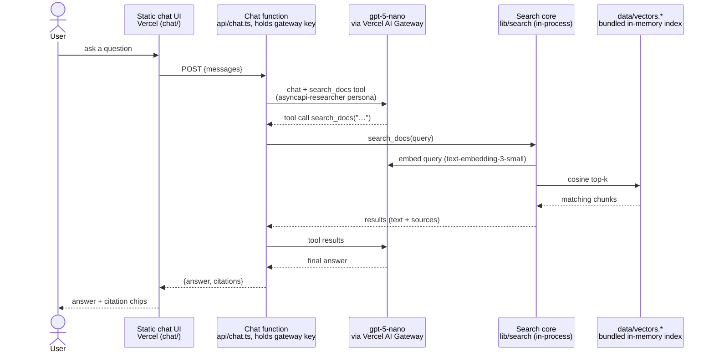
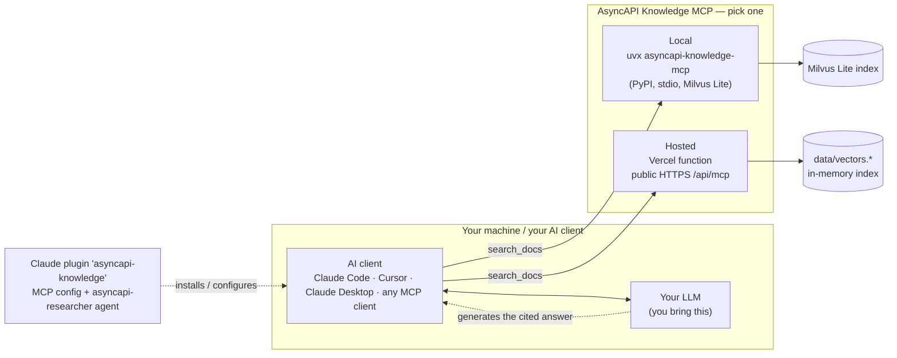

# Architecture

There is **one core product — the documentation MCP server** — and an **optional public chat**
layered on top. The RAG (retrieval) lives entirely in the search core; answer *generation* is
done by whatever LLM the consumer brings. The chat website is just one such consumer that we host.

## Components

| Component | Path | Role |
|---|---|---|
| **Search core** | `lib/search/` | The RAG. In-memory cosine search over the committed `data/vectors.*` index (built from asyncapi.com docs + the AsyncAPI 3.1.0 JSON Schema). Query embedding via the Vercel AI Gateway. |
| **MCP server** | `api/mcp.ts` | Exposes the search core as the `search_docs` tool over MCP Streamable HTTP at `/api/mcp`. Shipped two ways: the public Vercel function, **and** the `asyncapi-knowledge-mcp` PyPI package (OpenCrane + Milvus Lite, runs locally via `uvx`). |
| **Claude plugin** | `plugins/asyncapi-knowledge/` | Registers the MCP + an `asyncapi-researcher` agent for Claude Code. |
| **Chat website** *(optional)* | `chat/` + `api/chat.ts` | A static page + a stateless Vercel function that runs the agent loop with `gpt-5-nano` via the Vercel AI Gateway. **The only part that generates answers or holds the gateway key for inference.** |

Two ways to consume the knowledge base, below.

## Flow 1 — Public chat website

We provide the model (`gpt-5-nano` via the Vercel AI Gateway) and the orchestration, so a
visitor needs **zero setup**. The chat function calls the search core **in-process** — no HTTP
hop to its own MCP endpoint.

The loop (tool call → search → results → continue) can repeat up to `MAX_TOOL_ROUNDS`. The
function holds the AI Gateway key, enforces the origin allowlist and body-size limits, and
each cited chunk carries its asyncapi.com page URL (or the JSON Schema's GitHub URL). Nothing
is persisted.

**Local development:** `scripts/run-local.sh` (default offline mode) swaps both backends —
inference is routed to a local Ollama instance (OpenAI-compatible, via `CHAT_MODEL_BASE_URL`)
and search is delegated to a locally running OpenCrane MCP server (via `SEARCH_MCP_URL`) instead
of the in-process vector index. No gateway key is needed in offline mode.

## Flow 2 — Your own agent (local or any MCP client)

You bring your own model and client; you consume **only** the `search_docs` retrieval tool.
**No gpt-5-nano, no chat function, no website involved.**

The Claude plugin is just a convenience that pre-wires the MCP connection and ships the
`asyncapi-researcher` persona; pointing any MCP client at `uvx asyncapi-knowledge-mcp` (local)
or the hosted endpoint works the same way.

## Why it's split this way

- **Retrieval vs generation.** The MCP only *retrieves* (`search_docs` over the vector index).
  Generating a cited answer needs an LLM + a tool-calling loop — that runs in the consumer
  (the chat function, or your own agent), never in the MCP.
- **The chat function is thin and optional.** It exists only because a *public, static* website
  cannot hold an API key or run the agent loop itself. Drop `chat/` + `api/chat.ts` and the
  product is still complete: MCP + plugin + PyPI package.
- **One index, two serving formats.** The Vercel path serves `data/vectors.*` (API-embedded,
  in-memory — fits serverless); the PyPI path serves a Milvus Lite index with a local embedding
  model (fits offline use). Both are built from the same `.opencrane/chunks.json`.
- **Release tracks are independent:** the weekly refresh commits content and Vercel auto-deploys
  the site + hosted MCP; `publish-pypi.yml` ships the local package on a GitHub release.
