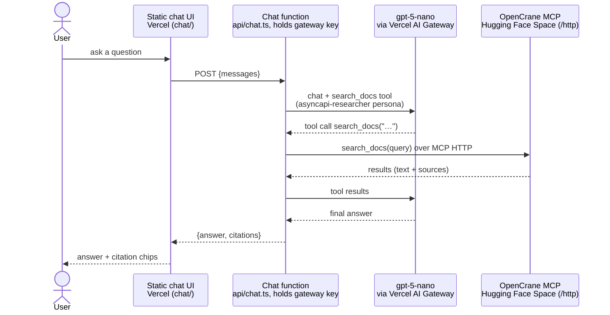
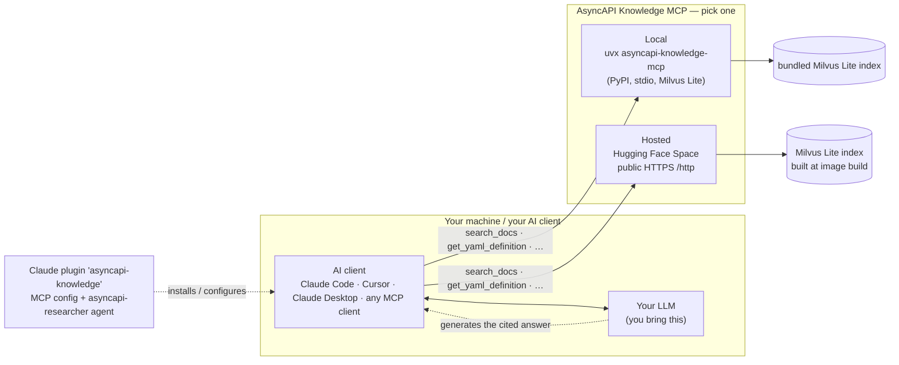

# Architecture

There is **one core product — the documentation MCP server** — and an **optional public chat**
layered on top. The RAG (retrieval) lives entirely in the OpenCrane MCP server; answer
*generation* is done by whatever LLM the consumer brings. The chat website is just one such
consumer that we host.

## Components

| Component | Where | Role |
|---|---|---|
| **MCP server (the RAG)** | [Hugging Face Docker Space](https://huggingface.co/spaces/derberg/asyncapi-knowledge-mcp) (`space/`) **and** the `asyncapi-knowledge-mcp` PyPI package | OpenCrane + Milvus Lite + a local embedding model. Exposes `search_docs`, `get_yaml_definition`, `get_list_members`, `get_metadata_schema`. Built from asyncapi.com docs + the AsyncAPI 3.1.0 JSON Schema. No API keys anywhere. |
| **Claude plugin** | `plugins/asyncapi-knowledge/` | Registers the PyPI MCP server (pinned version) + an `asyncapi-researcher` agent for Claude Code. |
| **Chat website** *(optional)* | `chat/` + `api/chat.ts` on Vercel | A static page + a stateless function that runs the agent loop with `gpt-5-nano` via the Vercel AI Gateway and searches through the Space's MCP endpoint (`SEARCH_MCP_URL`). **The only part that generates answers or holds any key.** |

Two ways to consume the knowledge base, below.

## Flow 1 — Public chat website

We provide the model (`gpt-5-nano` via the Vercel AI Gateway) and the orchestration, so a
visitor needs **zero setup**. The chat function delegates search to the Hugging Face Space
over MCP Streamable HTTP.

The loop (tool call → search → results → continue) can repeat up to `MAX_TOOL_ROUNDS`
(default 16). The function holds the AI Gateway key, enforces the origin allowlist and
body-size limits, and each cited chunk carries its asyncapi.com page URL (or the JSON
Schema's GitHub URL). Nothing is persisted.

**Local development:** `scripts/run-local.sh` (default offline mode) swaps both backends —
inference is routed to a local Ollama instance (OpenAI-compatible, via `CHAT_MODEL_BASE_URL`)
and search to a locally running OpenCrane MCP server. No keys needed. `--hosted` mode is
production parity: AI Gateway inference + the public Space for search.

## Flow 2 — Your own agent (local or any MCP client)

You bring your own model and client; you consume **only** the retrieval tools.
**No gpt-5-nano, no chat function, no website involved.**

The Claude plugin is just a convenience that pre-wires the MCP connection and ships the
`asyncapi-researcher` persona; pointing any MCP client at `uvx asyncapi-knowledge-mcp` (local)
or the Space endpoint works the same way.

## Why it's split this way

- **Retrieval vs generation.** The MCP only *retrieves*. Generating a cited answer needs an
  LLM + a tool-calling loop — that runs in the consumer (the chat function, or your own
  agent), never in the MCP.
- **The chat function is thin and optional.** It exists only because a *public, static* website
  cannot hold an API key or run the agent loop itself. Drop `chat/` + `api/chat.ts` and the
  product is still complete: MCP (Space + PyPI) + plugin.
- **One index, one format.** Both serving paths (Space and PyPI package) run the same
  OpenCrane + Milvus Lite stack with a local embedding model, built from the same committed
  `.opencrane/chunks.json` + `.opencrane/embeddings.json`. There is no separate Vercel-side
  index — Vercel only runs the chat.
- **Release tracks are independent:** the weekly refresh commits content (chunks + LFS
  embedding artifacts); a GitHub release publishes the PyPI package and re-pins + rebuilds
  the Space (`publish-pypi.yml`). Vercel auto-deploys the chat UI on every push.
